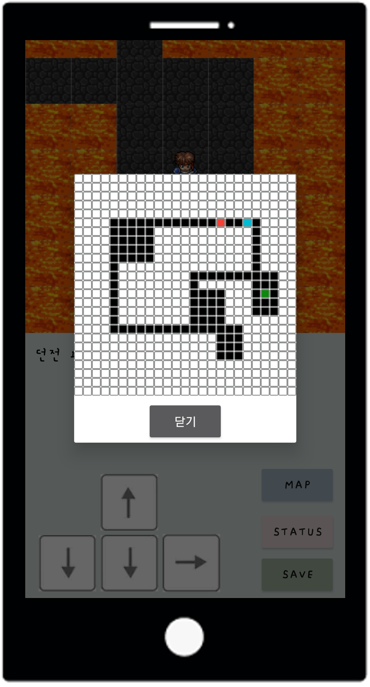
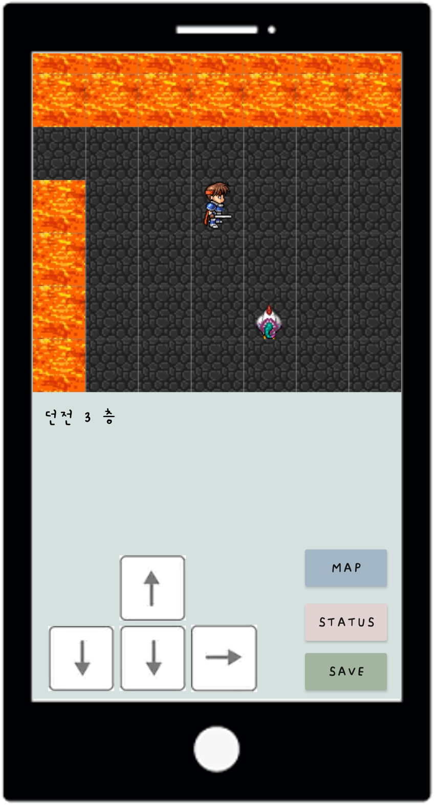
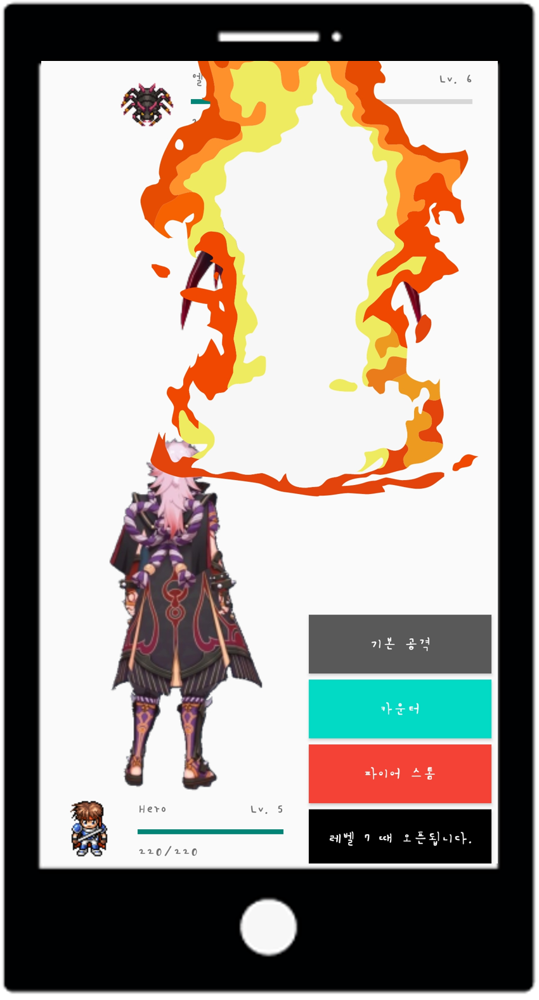
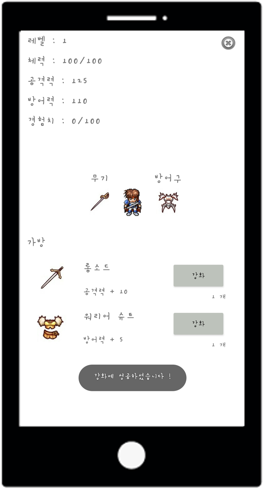

# 🎮  RogueLike
<p align="center">
   &nbsp;
   &nbsp;
   &nbsp;
  
</p>
<br>

> 게임 장르 중 하나인 로그라이크를 기반으로 만들어본 게임

### 💭 Introduction
- Kotlin을 공부하고, 복습 겸 처음으로 만들어본 앱으로, Kotlin에 대해 많이 익숙해지는 계기가 되었던 프로젝트이다.
  
### 📖 Detail
- Game내에서 Map을 누를 경우, Map정보를 확인할 수 있다.
- 캐릭터가 이동하다가 몬스터를 마주치게 될 경우 몬스터는 캐릭터를 쫓아오게 된다.
- 전투에서 승리할 경우, 경험치와 아이템을 획득해 아이템을 강화시키면서 캐릭터를 육성하여 최종 보스를 잡으면 게임이 끝이난다.


#### 🗺️ Map Algorithm
 맵은 25 * 25 크기로 매 층마다 무작위로 생성되며, 맵에서 각 방의 크기는 2~5 * 2~5로 랜덤하게 선정되어, 개수는 3~7개 중 랜덤으로 생성된다.
```Kotlin
        // dungeon 크기는 25 * 25
        dungeon = Array(25) { IntArray(25) }

        // dungeon 들어갈 방의 갯수는 3 ~ 7
        numberOfRooms = Random.nextInt(5)

        if (numberOfRooms < 2) numberOfRooms = numberOfRooms + 5
        createdRoom = Array(numberOfRooms + 1) { IntArray(2) }

        for (i in 0..numberOfRooms) {

            // 방 교차 / 중복 검사
            if (roomOverlapPrevent()) {
                for (x in 0..room_x) {
                    for (y in 0..room_y) {
                        dungeon[dungeon_x + x][dungeon_y + y] = 1
                    }

                }
            }

            createdRoom[i][0] = dungeon_x
            createdRoom[i][1] = dungeon_y
          }
```
<br>
맵에서 생성된 방은 교차되거나 중복되지 않게 이미 생성된 방과의 거리가 1 이하라면 다시 그리도록 알고리즘을 구성하였다.

``` Kotlin
fun roomOverlapPrevent(): Boolean {
        var isExist = true
        DuplicateCheck@ while (isExist) {
            // 25 * 25 크기 중 랜덤으로 한 점을 선택
            val pickedPoint =
                Random.nextInt((dungeon.size - borderSize) * (dungeon.size - borderSize))

            // 선택한 점에 x, y축을 매칭
            dungeon_x = (pickedPoint / 23) + 1
            dungeon_y = (pickedPoint % 23) + 1


            // 방이 아직 생성이 안된 곳일 경우
            if (dungeon[dungeon_x][dungeon_y] .isZero()) {

                // 방의 크기는 2 ~ 6
                room_x = minRoomSize + (Random.nextInt(4))
                room_y = minRoomSize + (Random.nextInt(4))

                // 던전의 크기보다 커질경우
                if (dungeon_x + room_x >= dungeon.size - borderSize
                    || dungeon_y + room_y >= dungeon.size - borderSize
                ) {
                    continue@DuplicateCheck
                }

                for (j in 0..room_x) {
                    if (j .isZero()) {
                        if (!dungeon[dungeon_x - 1][dungeon_y] .isZero()) {
                            continue@DuplicateCheck
                        }
                    }
                    if (!dungeon[dungeon_x + j][dungeon_y - 1] .isZero()) {
                        continue@DuplicateCheck
                    }
                    if (!dungeon[dungeon_x + j][dungeon_y] .isZero()) {
                        continue@DuplicateCheck
                    }

                    for (k in 0..room_y) {
                        if (k .isZero()) {
                            if (!dungeon[dungeon_x][dungeon_y - 1] .isZero()) {
                                continue@DuplicateCheck
                            }
                        }
                        if (!dungeon[dungeon_x][dungeon_y + k] .isZero()) {
                            continue@DuplicateCheck
                        }

                        if (!dungeon[dungeon_x - 1][dungeon_y + k] .isZero()) {
                            continue@DuplicateCheck
                        }

                        if (dungeon_x + j < dungeon.size) {
                            if (j == room_x && !dungeon[dungeon_x + j + 1][dungeon_y + k].isZero()) {
                                continue@DuplicateCheck
                            }
                        }
                        if (k == room_y && dungeon_y + k < dungeon.size) {
                            if (!dungeon[dungeon_x + j][dungeon_y + k + 1] .isZero()) {
                                continue@DuplicateCheck
                            }
                        }
                    }
                }

                isExist = false
            }
        }
        return true
    }
```

- #### 🐗 Monster Algorithm

캐릭터가 움직이다가, 몬스터가 맵에 보일 경우, 몬스터가 움직이기 시작한다.
```Kotlin
  fun checkHeroBoundary(): Boolean {
        val heroX = hero_position / 25
        val heroY = hero_position % 25

        for (i in (heroX - 3)..(heroX + 3)) {
            for (j in (heroY - 3)..(heroY + 3)) {
                if (i >= dungeon.size || i < 0
                    || j >= dungeon.size || j < 0
                ) {
                    break
                } else if (dungeon[i][j] == MONSTER) {
                    val focusposition = (i * 25) + j
                    focusIndex = monster_position.indexOf(focusposition)
                    return true
                }
            }
        }
        return false
    }
```

<br>

몬스터는 우선적으로 캐릭터의 x축 값을 쫓아가며, x축 값이 똑같아질 경우 y축으로 이동을 시작한다.
이 때, 이동하다가 길이 막혀있을 경우 캐릭터와 가장 가까워질 수 있는 차선책을 선택하도록 한다.
```Kotlin
fun monsterMove(): Boolean {
        val MOVE_TOP = 0
        val MOVE_BOTTOM = 1
        val MOVE_LEFT = 2
        val MOVE_RIGHT = 3

        var beforeMonsterX = monster_position[focusIndex] / 25
        var beforeMonsterY = monster_position[focusIndex] % 25

        val heroPositionX = hero_position / 25
        val heroPositionY = hero_position % 25

        var afterMonsterX = beforeMonsterX
        var afterMonsterY = beforeMonsterY

        var DIRECTION: String = ""

        // plus -> 몬스터가 아래 있어서 위로 올라가야함
        // minus -> 몬스터가 위에 있어서 아래로 내려가야함
        if (monster_position[focusIndex] < hero_position) {
            DIRECTION = "MINUS"
        } else if (hero_position < monster_position[focusIndex]) {
            DIRECTION = "PLUS"
        }

        when {
            DIRECTION.contains("MINUS") -> {
                if (beforeMonsterX < heroPositionX) {
                    if (!dungeon[beforeMonsterX + 1][beforeMonsterY].isZero()) {
                        afterMonsterX++
                        monsterDistance = MOVE_TOP
                    } else if (heroPositionY > afterMonsterY &&
                        !dungeon[beforeMonsterX][beforeMonsterY + 1].isZero()
                    ) {
                        afterMonsterY++
                        monsterDistance = MOVE_RIGHT
                    } else {
                        afterMonsterY--
                        monsterDistance = MOVE_LEFT
                    }
                } else if (beforeMonsterX == heroPositionX) {
                    if(!dungeon[beforeMonsterX][beforeMonsterY + 1].isZero()){
                        afterMonsterY++
                        monsterDistance = MOVE_RIGHT
                    }else{
                        afterMonsterX++
                        monsterDistance = MOVE_TOP
                    }
                }

            }
            DIRECTION.contains("PLUS") -> {
                if (heroPositionX < beforeMonsterX) {
                    if (!dungeon[beforeMonsterX - 1][beforeMonsterY].isZero()) {
                        afterMonsterX--
                        monsterDistance = MOVE_BOTTOM
                    } else if (heroPositionY > afterMonsterY &&
                        !dungeon[beforeMonsterX][beforeMonsterY - 1].isZero()
                    ) {
                        afterMonsterY++
                        monsterDistance = MOVE_RIGHT
                    } else {
                        afterMonsterY--
                        monsterDistance = MOVE_LEFT
                    }
                } else if (beforeMonsterX == heroPositionX) {
                    if (!dungeon[beforeMonsterX][beforeMonsterY - 1].isZero()) {
                        afterMonsterY--
                        monsterDistance = MOVE_LEFT
                    } else {
                        afterMonsterX--
                        monsterDistance = MOVE_BOTTOM
                    }
                }
            }
        }

        monster_position[focusIndex] = (afterMonsterX * 25) + afterMonsterY

        dungeon[beforeMonsterX][beforeMonsterY] = 1

        if (stair_respawn) dungeon[beforeMonsterX][beforeMonsterY] = STAIR
        stair_respawn = dungeon[afterMonsterX][afterMonsterY] == STAIR

        dungeon[afterMonsterX][afterMonsterY] = MONSTER


        if (abs(monster_position[focusIndex] - hero_position) == 1
            || abs(monster_position[focusIndex] - hero_position) .isZero()
            || abs(monster_position[focusIndex] - hero_position) == dungeon.size
        ) {
            return true
        }
        return false
    }
```


#### ✅ Languages
<p>
  
  
</p>
